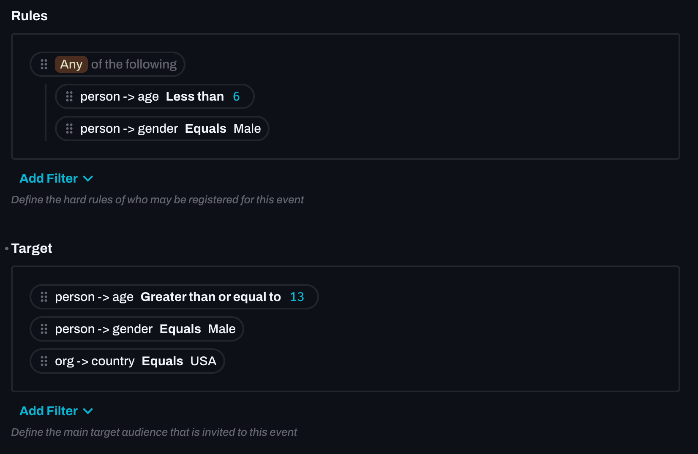

# Custom filter & rule Interface - for Directus 9

This is a custom filter & rule interface for Directus 9. It allows you to setup an interface with defined properties that users can then select and add values and conditions for.



Using the [Rule Filter Validator](https://github.com/u12206050/rule-filter-validator) library you can validate and test the rules stored in your frontend and backend.

Support for `$NOW` and field functions such as `year()` and `count()` is supported in [Rule Filter Validator](https://github.com/u12206050/rule-filter-validator) since version `1.5.0`


## Install
Copy the `index.js` file from the dist folder into your project eg. `PATH_TO_DIRECTUS_PROJECT/extensions/interfaces/filters`


## Develop

 - Clone repo
 - `npm install`
 - Update the path in package.json from `dist/index.js` to 
    `PATH_TO_DIRECTUS_PROJECT/extensions/interfaces/filters`
 - `npm run dev`


### Config

When setting up you as the developer should add the properties that can be chosen

``` ts
type Properties = {
    [Property: string]: string | Property[] | AdvProp | RelationProp
}

type PropType = 'string' | 'boolean' | 'integer' | 'timestamp' | 'text';

type AdvProp = {
    type: PropType
    label?: string
    choices?: Choice[]
}

type RelationProp = {
    type: PropType
    label: string
    field: string
    template: string
    interface: string
    collection: string
    filter?: Filter
}
```

### Example 

``` json
{
    "org": {
        "id": {
            "type": "integer",
            "field": "id",
            "template": "{{name}}",
            "interface": "select-dropdown-m2o",
            "collection": "organizations"
        },
        "country": {
            "type": "string",
            "choices": "$COUNTRIES"
        }
    },
    "person": {
        "id": "integer",
        "age": "integer",
        "dob": "dateTime",
        "active": "boolean",
        "gender": {
            "type": "string",
            "choices": [
                {
                    "text": "Male",
                    "value": "male"
                },
                {
                    "text": "Female",
                    "value": "female"
                }
            ]
        }
    }
}
```